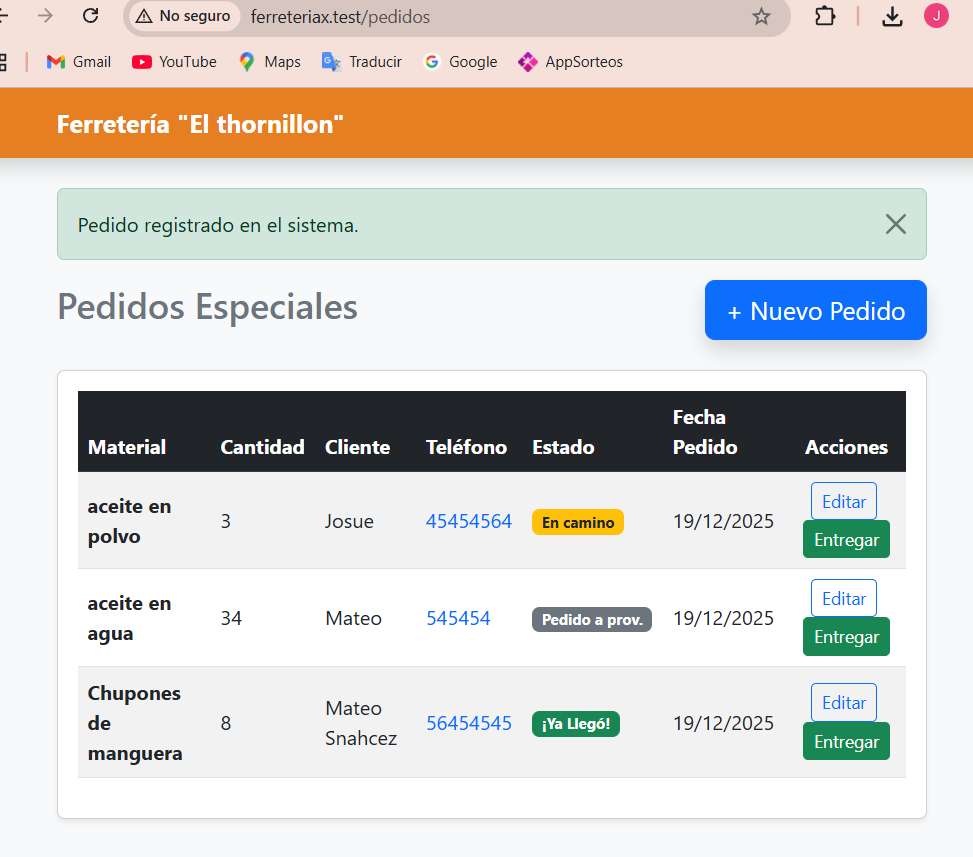
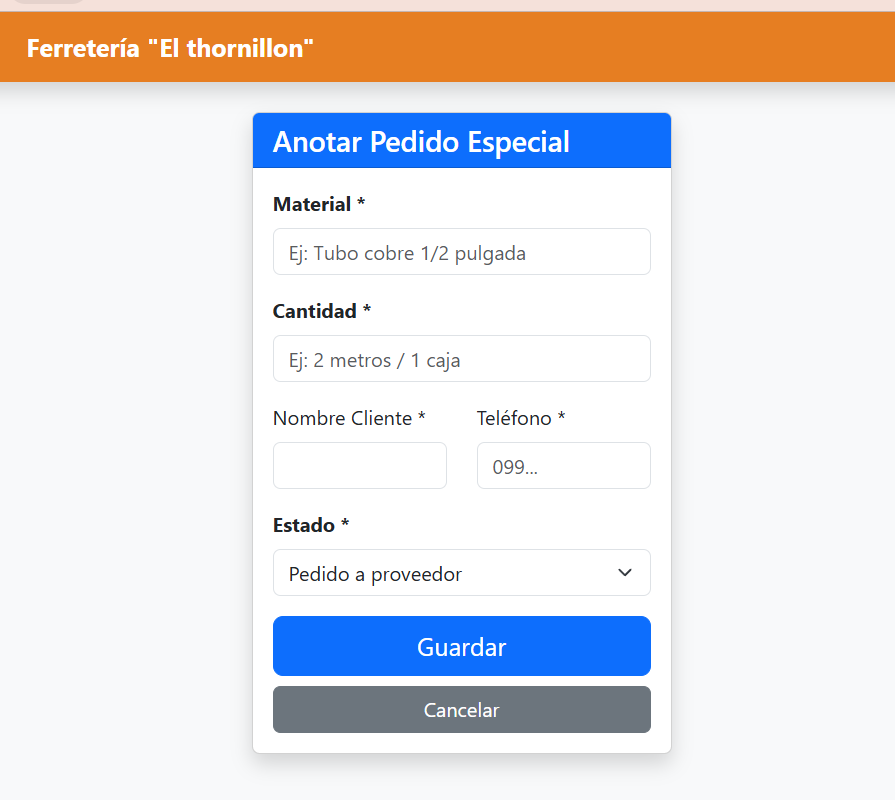
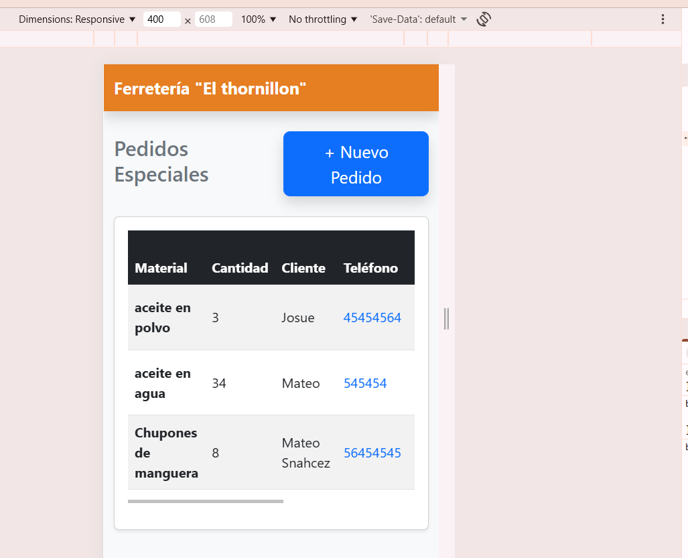

# Prueba - Desarrollo en Plataformas

**Estudiante:** Josue Tenesaca
**Fecha:** 19/12/2025
**Paralelo:** 3

---

## Mis Decisiones de Diseño

**Link de mi repositorio**
* **URL** `https://github.com/JosueM333/Ferreteria-PruebPractica.git`

### 1. Tabla
Se definió la estructura de la tabla con los siguientes campos:

| Campo | Tipo | ¿Obligatorio? |
| :--- | :--- | :--- |
| material | string | si |
| cantidad | string | si |
| unidadesmed| string | si |
| cliente | string | si |
| telefono | strings | si |
| estado | strings | si |

### Justifiación de la Tabla
he decidido usar esta tabla para simplificar el diseño.
Debido a la simpleza de esta proyecto considere que con esta tabla es más que suficiente para satisfacer los requerimientos de el usuario y para solventar sus problemas iniciales
Más adelante se podria implementar 2 tablas separadas y que la base de datos almacene a los clientes.
Todos los cambos son mandatorios, es decir que todos deben ser llenados, caso contrario no se podra registrar el pedido.

### 2. Tipos de vehículo
Se agregaron 4 tipos de Estado:
* Pedido a proveedor
* En camino
* llego
* entregado

### 3. ¿Se puede eliminar registros?
SI, si se puede eliminar registros, los registros se eliminan automaticamente al momento de marcar que el pedido ya fue entregado. La rázon del porque lo hice de esta forma es que, el usuario solo necesita que se gestionen los pedidos hasta que salgan de la ferreteria. Entonces DE MOMENTO no hay una necesidad de almacenar permanentemente los registros, además de que estamos evitando que la base de datos se sobrecargue de datos innecesarios.

--

### Laravel Herd
Se utilizó Laravel Herd para la gestión del proyecto.

**Configuruación de Base de Datos**
Crear la base de datos (Opción A - MySQL)
Se creó la base de datos utilizando sentencias SQL:
CREATE DATABASE FERRETERIABDX;

**Pruebas de la Aplicación**

1. Listado

2. Formulario

3. Vista Móvil

